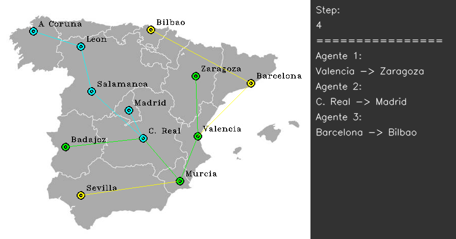

# Optimización de recorridos con Aprendizaje por Refuerzo Multiagente (MARL)

La optimización de recorridos es un problema clave en sectores como la logística, el transporte, la planificación urbana o la distribución de recursos. Resolverlo de manera eficiente no solo reduce costes y tiempos, sino que también mejora la utilización de recursos y la calidad del servicio.

Tradicionalmente, este tipo de problemas se han abordado mediante algoritmos de optimización clásica (heurísticas, algoritmos genéticos, etc.). Sin embargo, el **Aprendizaje por Refuerzo Multiagente (MARL)** ofrece un enfoque prometedor: permite que varios agentes aprendan en un entorno compartido, desarrollando estrategias colaborativas o competitivas para alcanzar objetivos individuales y globales.

Este proyecto explora el potencial de los sistemas MARL para resolver problemas de optimización de recorridos. Se ha utilizado como base el repositorio [MultiAgentSB3](https://github.com/inakivazquez/MultiAgentSB3), que proporciona entornos multiagente compatibles con **Stable-Baselines3 (SB3)** y facilita la implementación y entrenamiento de agentes en escenarios multiagente de manera similar a los de agente único.

---

## Puntos clave del proyecto
- **Diseño de entornos multiagente:** modelado de problemas de optimización como escenarios MARL.  
- **Entrenamiento con Stable-Baselines3:** uso de algoritmos de Deep RL adaptados a múltiples agentes.  
- **Aprendizaje colaborativo y competitivo:** análisis de cómo los agentes coordinan sus acciones para mejorar el rendimiento global.   

---

## Lo que he aprendido
Este proyecto me ha permitido:  
- Diferenciar claramente entre entornos de **agente único** y **multiagente**.  
- Aprender a **modelar problemas reales** como entornos de RL, definiendo estados, acciones y recompensas.  
- Utilizar frameworks modernos como **Stable-Baselines3** y extensiones para MARL.  
- Comprender el papel de la **cooperación y coordinación** en la optimización de sistemas multiagente.  
- Evaluar de manera crítica las **ventajas y limitaciones del MARL** frente a enfoques tradicionales de optimización.  

---

## Recursos
- Repositorio base: [MultiAgentSB3](https://github.com/inakivazquez/MultiAgentSB3)  
- Frameworks utilizados: Stable-Baselines3 (SB3), Gym  

---

## Ejemplo del aprendizaje de tres agentes colaborando

