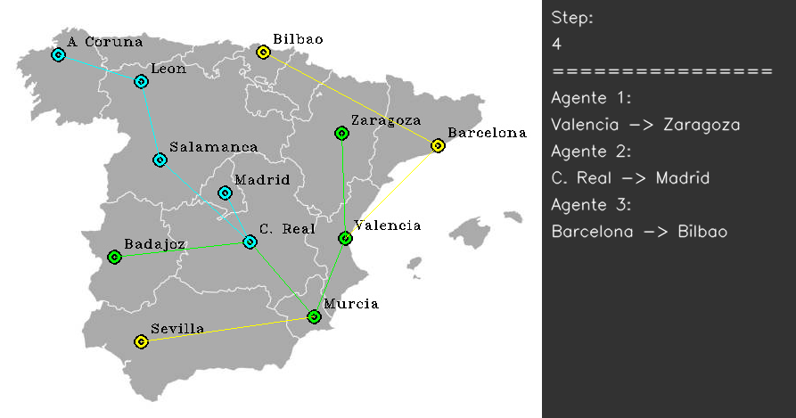

# Optimización de recorridos con Aprendizaje por Refuerzo Multiagente (MARL)

La optimización de recorridos es un problema clave en sectores como la logística, el transporte, la planificación urbana o la distribución de recursos. Resolverlo de manera eficiente no solo reduce costes y tiempos, sino que también mejora la utilización de recursos y la calidad del servicio.

Tradicionalmente, este tipo de problemas se han abordado mediante algoritmos de optimización clásica (heurísticas, algoritmos genéticos, etc.). Sin embargo, el **Aprendizaje por Refuerzo Multiagente (MARL)** ofrece un enfoque prometedor: permite que varios agentes aprendan en un entorno compartido, desarrollando estrategias colaborativas o competitivas para alcanzar objetivos individuales y globales.

Este proyecto explora el potencial de los sistemas MARL para resolver problemas de optimización de recorridos. Se ha utilizado como base el repositorio [MultiAgentSB3](https://github.com/inakivazquez/MultiAgentSB3), que proporciona entornos multiagente compatibles con **Stable-Baselines3 (SB3)** y facilita la implementación y entrenamiento de agentes en escenarios multiagente de manera similar a los de agente único.

---

## Uso de SB3 en un entorno multiagente

Aunque *Stable-Baselines3 (SB3)* está diseñado para entornos de agente único, este proyecto consigue aplicarlo en escenarios multiagente gracias a una **ejecución síncrona y alternada de los entrenamientos**. Esto es posible por varios motivos:

- Los entornos multiagente pueden estar compuestos por agentes **homogéneos o heterogéneos**.  
- Cada agente se entrena de forma independiente con un *wrapper* que lo hace parecer un entorno de agente único para SB3.  
- Es posible usar **diferentes algoritmos simultáneamente** en el mismo entorno (ejemplo: entrenar un agente con PPO y otro con SAC).  
- Los agentes pueden tener **espacios de observación y acción distintos**, según sus necesidades.  

### ¿Cómo funciona la sincronización?
- El entrenamiento se realiza **alternando fases de aprendizaje** entre los distintos agentes.  
- Mientras un agente se está entrenando y actualizando su política, los demás actúan con sus políticas congeladas (estáticas).  
- Este ciclo de alternancia puede configurarse en número de iteraciones y timesteps (ejemplo: 3 agentes, 100 iteraciones, 1.000.000 pasos → cada agente entrena 10.000 pasos por iteración).  
- También es posible **congelar algunos agentes** y continuar entrenando a otro, para analizar cómo mejora en un entorno estacionario.  

### Clases clave
- **`BaseMAEnv`:** clase base de la que heredan los entornos multiagente.  
- **`AgentMAEnv`:** un *wrapper* que convierte a cada agente en un entorno Gymnasium de agente único, creando la ilusión de que SB3 entrena solo a un agente. Internamente, existen tantas instancias de esta clase como agentes a entrenar en el entorno.  

En resumen, gracias a este mecanismo, SB3 puede aplicarse directamente a entornos multiagente sin modificar su núcleo, aprovechando su potencia y estabilidad en el entrenamiento de políticas.

---

## Puntos clave del proyecto
- **Diseño de entornos multiagente:** modelado de problemas de optimización como escenarios MARL.  
- **Entrenamiento con Stable-Baselines3:** uso de algoritmos de Deep RL adaptados a múltiples agentes.  
- **Aprendizaje colaborativo y competitivo:** análisis de cómo los agentes coordinan sus acciones para mejorar el rendimiento global.   

---

## Lo que he aprendido
Este proyecto me ha permitido:  
- Diferenciar claramente entre entornos de **agente único** y **multiagente**.  
- Aprender a **modelar problemas reales** como entornos de RL, definiendo estados, acciones y recompensas.  
- Utilizar frameworks modernos como **Stable-Baselines3** y extensiones para MARL.  
- Comprender el papel de la **cooperación y coordinación** en la optimización de sistemas multiagente.  
- Evaluar de manera crítica las **ventajas y limitaciones del MARL** frente a enfoques tradicionales de optimización.  

---

## 📂 Organización del repositorio
- **`demo_1.py` … `demo_7.py`:** scripts que muestran *renders* de los recorridos realizados por los agentes en diferentes escenarios y configuraciones.  
- **`base.py` y `utils.py`:** módulos que contienen elementos clave en la creación de entornos y en la definición del comportamiento de los agentes.  
- **`train.py`:** scripts responsables de lanzar los entrenamientos de los agentes en los distintos entornos.
- **`env_logistic_v0.py` … `env_logistic_v2.py`**: Entornos multiagente creados desde la versión inicial más sencilla hasta la versión final.

---

## Recursos
- Repositorio base: [MultiAgentSB3](https://github.com/inakivazquez/MultiAgentSB3)  
- Frameworks utilizados: Stable-Baselines3 (SB3), Gym  

---

## Ejemplo del aprendizaje de tres agentes colaborando

